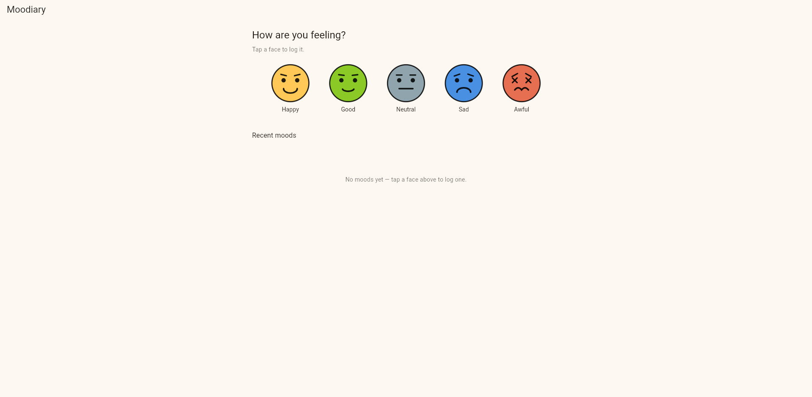
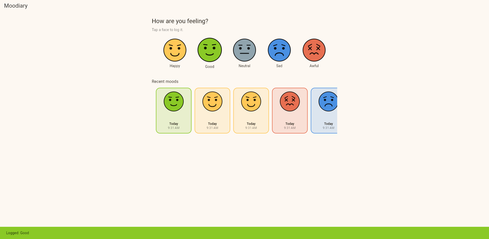

# Moodiary

A simple, cheerful Flutter app for logging how you feel. Tap a face to record your mood and watch your recent entries appear in a horizontal timeline.

## Features

- Five expressive moods — Happy, Good, Neutral, Sad, Awful — each rendered with a custom `CustomPainter` face (no image assets required).
- One-tap mood logging with an instant confirmation snackbar.
- Horizontal timeline of recent moods, color-coded by feeling and timestamped with `intl`.
- State managed with [Riverpod](https://pub.dev/packages/flutter_riverpod) (`ProviderScope` + `StateNotifier`).
- Material 3 theme with a warm, paper-like background.
- Runs on Android, iOS, Web, Windows, macOS, and Linux.

## Screenshots

| Empty state | After logging moods |
| --- | --- |
|  |  |

## Project structure

```
lib/
├── main.dart                      # App entry point, theme, ProviderScope
├── models/
│   └── mood.dart                  # Mood enum + MoodEntry model
├── state/
│   └── mood_entries_provider.dart # Riverpod StateNotifier for entries
├── screens/
│   └── mood_home_screen.dart      # Main screen layout
└── widgets/
    ├── mood_face.dart             # Reusable mood face widget
    ├── mood_face_painter.dart     # CustomPainter that draws each face
    ├── mood_picker.dart           # Row of tappable mood faces
    └── mood_timeline.dart         # Horizontal list of recent entries
```

## Getting started

Prerequisites:

- Flutter SDK (Dart `^3.11.5`)
- A configured target device (emulator, simulator, browser, or desktop)

Install dependencies and run:

```bash
flutter pub get
flutter run
```

To run on a specific platform:

```bash
flutter run -d chrome     # Web
flutter run -d windows    # Windows desktop
flutter run -d macos      # macOS desktop
```

## Generating launcher icons

App icons are configured via [`flutter_launcher_icons`](https://pub.dev/packages/flutter_launcher_icons) using `assets/icon/moodiary.webp`. To regenerate:

```bash
flutter pub run flutter_launcher_icons
```

## Tech stack

- **Flutter** + **Material**
- **flutter_riverpod** for state management
- **intl** for date/time formatting
- **CustomPainter** for the mood faces
